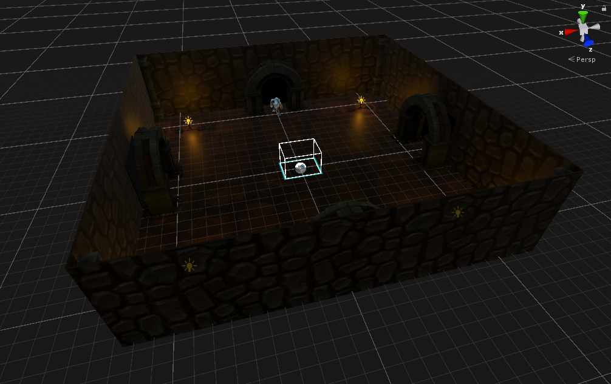
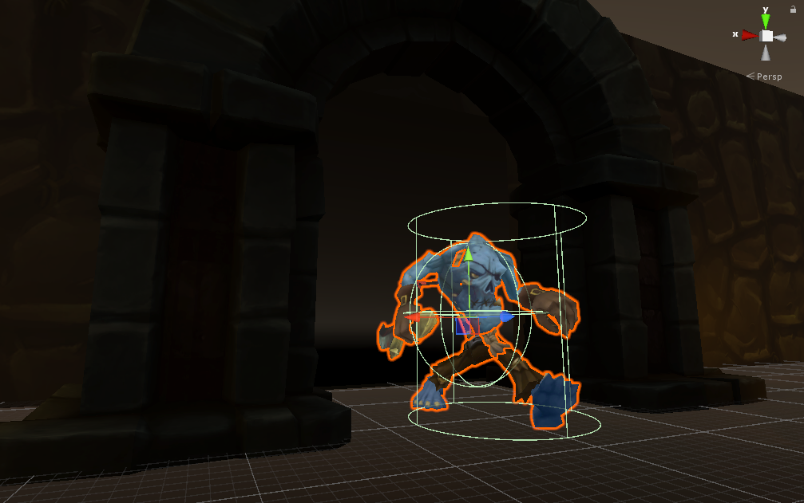

# ZombieDefender

### Description
This is our group's first VR project for CS375: Computer Graphics at Southeast Missouri State University. It's an arena style game that constantly spawns zombies. Try to survive as long as you can. The models used are by Bitgem, drop by their page to check out their work. [bitgem3d.com](https://shop.bitgem3d.com/)

### Purpose
We developed this project mostly to get accustomed to desktop VR development. We did this around Halloween time, so we decided to go with something spooky. This game features the instant teleportation locomotion with boundary checking, and the ability to grab and throw objects. All the other VR specific things are handily taken care of by the SteamVR Plugin.

##### The arena

##### One of many zombies

### Specs
- Unity 2018.2.12f1
- SteamVR Plugin 2.0.1
- Tested with Oculus Rift
